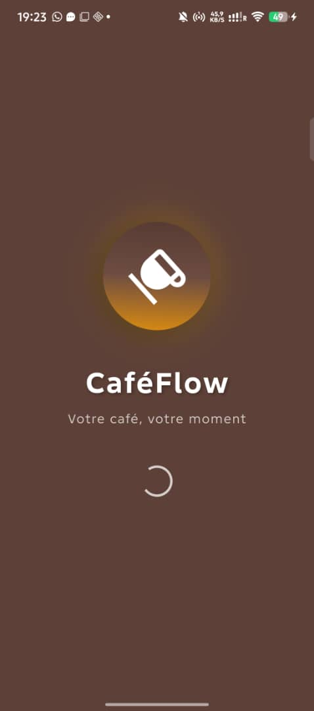
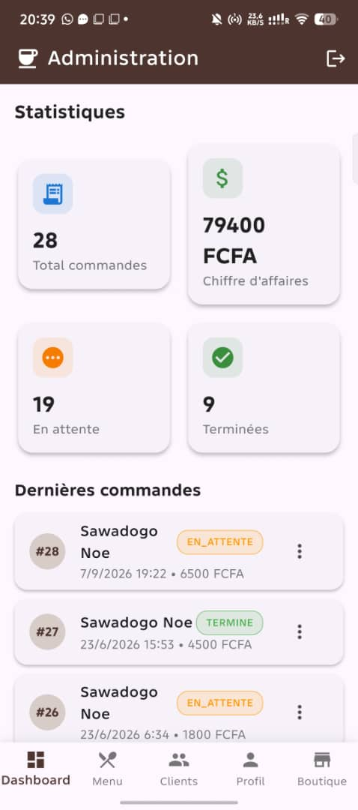
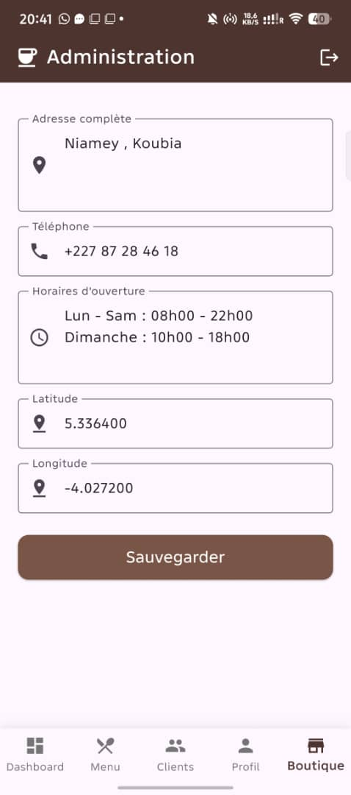
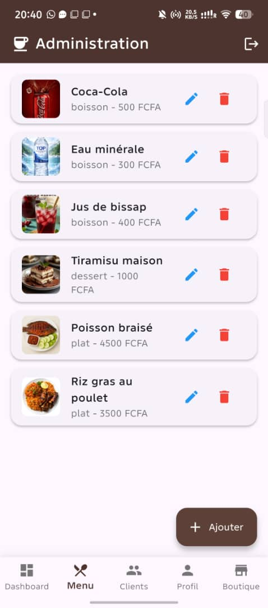
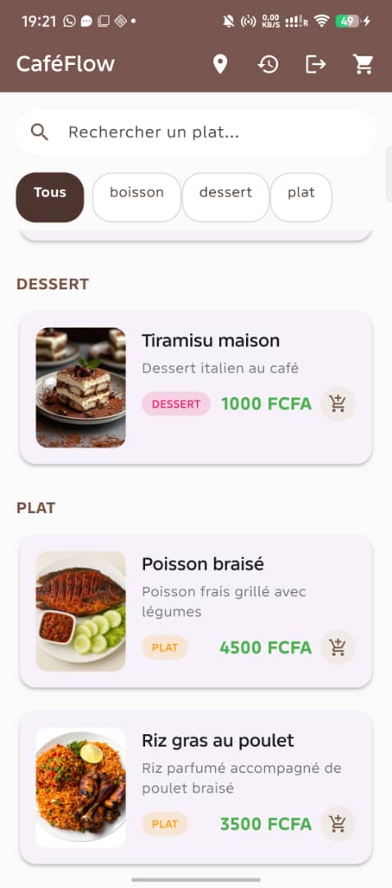
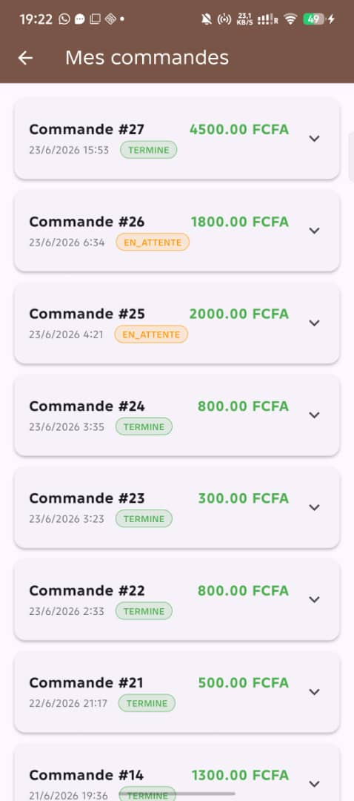
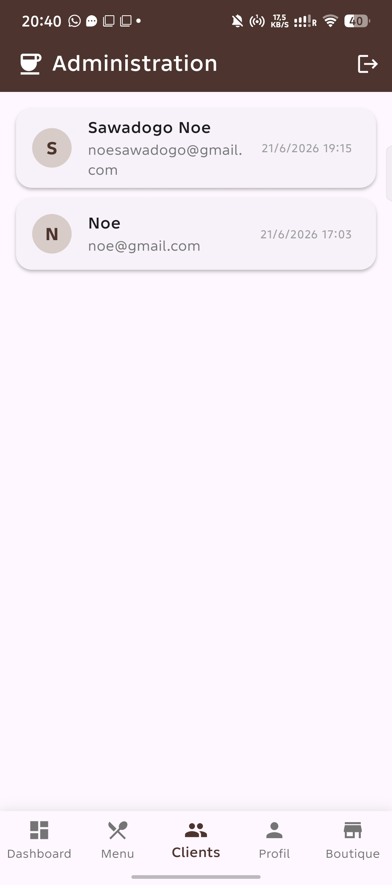
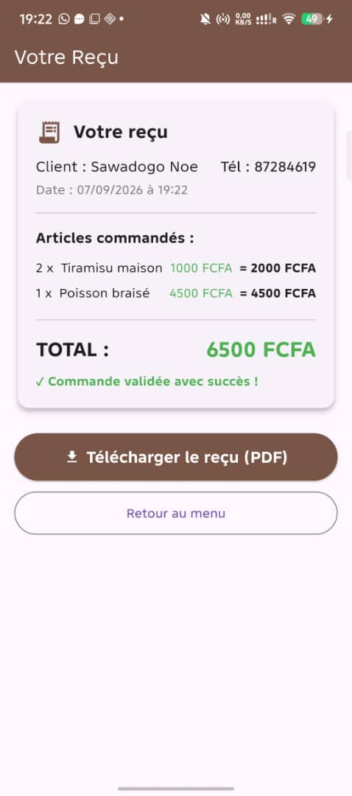
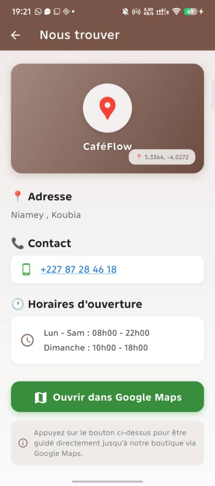

## 🌐 Tester en version Web (sans installation)

👉 [Cliquez ici pour tester CaféFlow dans votre navigateur](https://cafeflow1.netlify.app)

### 🔑 Identifiants de test
- **Email** : `admin@gmail.com`
- **Mot de passe** : `admin123`

## 🖼️ Aperçu de l'application

| Écran de démarrage | Dashboard Admin | Administration |
| :---: | :---: | :---: |
|  |  |  |

| Gestion du Menu (Admin) | Menu (Client) | Commandes |
| :---: | :---: | :---: |
|  |  |  |

| Gestion des Clients | Reçu généré | Localisation |
| :---: | :---: | :---: |
|  |  |  |
